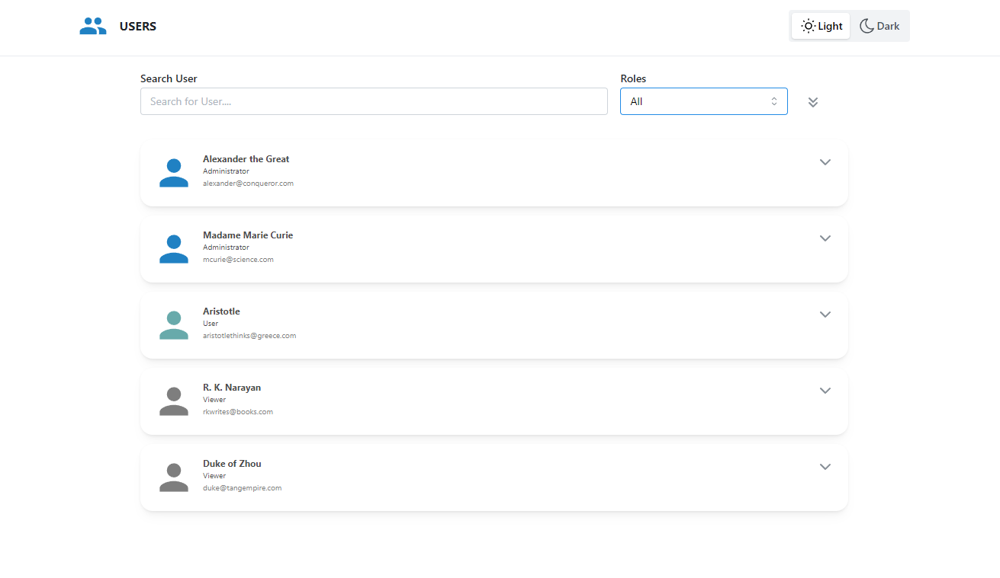

 How to run the project?? 
<b>HOW TO RUN THE WEB APPLICATION LOCALLY</b>

1. Pull the main github repository to a folder
2. Open the folder where you put the web application code in visual studio code
3. Run "npm install" in both the backend and frontend terminals
4. run "npm start" from the backend and frontend terminals
5. The web application should be running locally on your device

### `npm start`

#######################The react webpage walkthrough#################
<b>WHAT IS THIS WEBPage? </b>

<b> Brief WebPage Outline: </b>

This is a react take home task for Veryable. Here I have designed the frontend for displaying the users in a workspace. I have tried to make this simple webpage as userfriendlt as possible.

Required Features:
Displaying the users in a page.
Having collapsible card which displays the detailed information about the user.
Displaying user icon with different colors based on their roles.

**_Added Features_**

- I have added light mode and dark mode to the webpage so that it will be easir for admin to access page based on their preference
- I have added the global search bar on the top, making it easier for admin to search based on name, address, phonenumbers or other users features
- I have added the dropdown on top which separates the users based on roles so that admin can easily search candidates based on their roles
- There is global expand more button on the top, that will expand all the cards at once if needed to see the detailed view.

<b>Project details with pictures: </b>

<b>**_Home Page in light mode:_** </b>

<b>**_Home Page in Dark mode:_** </b>

<b>**_Expanded version of cards:_** </b>

<b>**_The global search bar that we have:_** </b>

<b>**_The dropdown for serach base on roles:_** </b>

